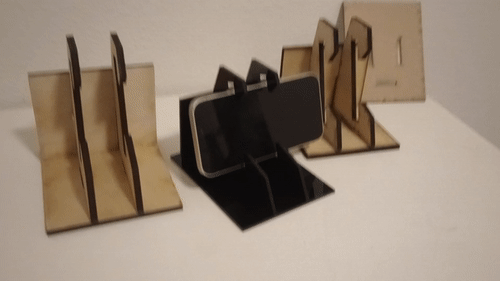
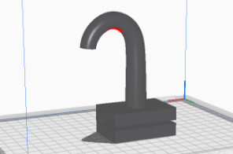
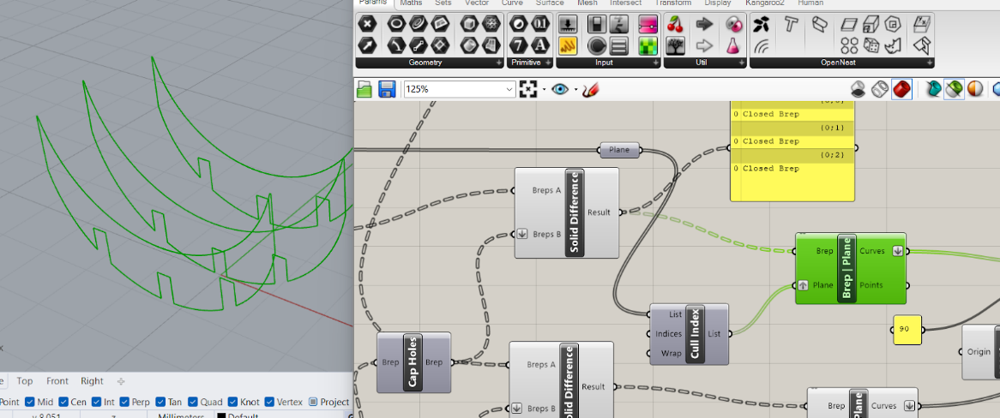
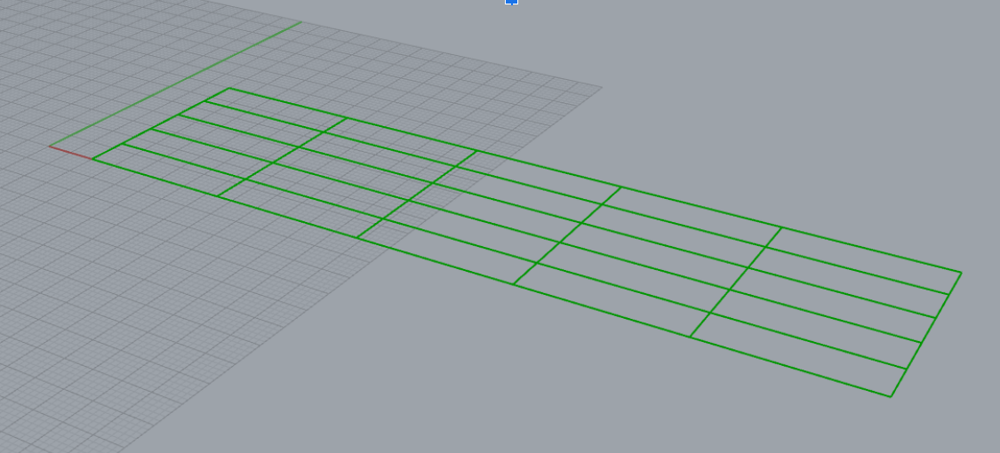
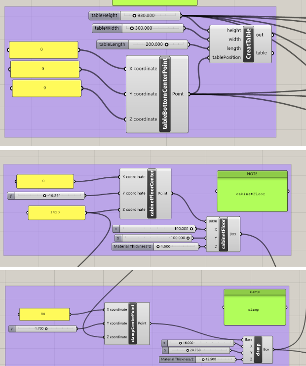

## Project 1 Deliverables
**Working Cell Phone Stand**: Create a functional cell phone stand tailored to your daily life as an MDes student using the Computational Design Cell Phone Stand Rhino Grasshopper Worked Example as a reference.

> I read through TJ's file and modified the size, table height, etc., to tailor it to my daily life usage for standing presentations. 
>
> 
>
> You might have noticed that the width may not seem to be a perfect fit. This is because I used to have a phone case and left the cap specifically for it. I went through three iterations to find the best working black acrylic phone stand for my needs. Here are more details about [how I made it](https://github.com/Berkeley-MDes/tdf-fa23-YuntingZh/blob/main/weekly-reports/Week1_2023_8_30.md#testing-the-black-acrylic-phone-stand) and its real-life use cases.

**Modified Grasshopper+Rhino File**: Customize the baseline Grasshopper+Rhino file to incorporate your unique geometric design. This modification should showcase your ability to reconfigure the Grasshopper file, involving various operations such as boolean operations, subtractions, offsets, etc.

**Custom Design System**: Develop a personalized design system through the Grasshopper file modifications. This system does not necessarily need to result in a cell phone stand but should still be applicable to your life as a student.

> I have two distinct files, each showcasing my ability to reconfigure Grasshopper while employing various operations such as boolean operations, subtractions, offsets, etc.
>
> 1. Kitchen Helper Design:
> [Insert Image of Kitchen Helper Design]
> [Insert Link to Grasshopper+Rhino File for Kitchen Helper Design]
> 2. Apple Holder:
> [Insert Image of Apple Holder]
> [Insert Link to Grasshopper+Rhino File for Apple Holder]
> These modifications have been a valuable learning experience, and I believe they reflect my understanding of computational design principles.
## Presentation Feedback & reply
"I really enjoyed seeing your design process. It was great to have a problem and really explore a solution. Don't let that 3D printer hold you back." 
- Reply: The reason I did not continue doing it isn't just the 3D printer. It's because when I finished my file and was ready to measure the actual cabinet floor size to input the numbers, I noticed that I only had a very thin plastic panel there, which is 3mm. I edited the clamp slot in my file to 3mm, brought it up to Cody, and we discussed how it would print on the Prusa. He told me it's better to abandon the slot idea entirely because it wouldn't work during printing anyway. 😭I felt sad because if I got rid of it, then the whole design would be meaningless. That's why I started my second apple holder project.

"Creating a practical design based on everyday challenges is impressive. I hope to see her new creation. She decided to take action and showcased her innovative creation. Her attitude is truly inspiring!" 
- Reply: Thank you.

"Lots of interesting explorations of the capabilities of the Rhino software, as well as very good attempts at 3D printing and laser cutting. When 3D printing, the more stable side of the model should be facing down. Very clear explanations about the background, usage scenarios, and model structure. More stable videos." 
- Reply: Yes, when it comes to 3D printing, the more stable side should be facing down. In my first attempt, I tried to print this. 

The part in the video merely shows some size issues and how sharp the tip was. Just to clarify, that's not how I was planning to print it. 😂Sorry if I misled you guys.. It didn't print, not because it's not printable (unfortunately, the two printers I was going to use that day are both broken, but that's not the reason I gave up), but because I didn't consider the cabinet thickness in my house and after I measured it it’s 3mm, I just felt my design is not a good design for my house anymore. I'm not sure what you mean by "more stable videos"?

"Just a question is that an AI voice? But Everything is well done." 
- Reply: It is an AI voice; I wrote the script and let the AI read it and edit the video based on the content.

"I thought the laser cutting is a really good idea and I love how you incorporated the play function into your design. I wonder how you transformed the 3D rhino file into 2D. I thought your research and concept are really clear and it was really well written. Including some fabrication processes would be really helpful." 
- Reply: For the kitchen helper idea, it was 3D only. The apple holder was created in 3D, and when I transformed it to 2D, I utilized Brep | Plane. It takes a parameter of a list of points that were defined in the XY and YZ planes, with the 3D object as the Brep. Here's a screenshot:.

"I would like to see how she created the lattices in Rhino or Grasshopper to create her final laser cut design." 
- Reply : If the lattices you mean is this, it’s made by<img src="../weekly-reports/images/P1_Refine_lattices_2.png" alt=P1_Refine_lattices_2" height="300". Thanks for pointing that out, I will re-edit my video to incorporate more working progress. I didn’t incorporate that much because I thought it’s just a very basic process like construction box and solid union and deconstruction edges, etc.  I didn't have a really fancy design until I started to work on the apple holder, but I will definitely explain more in my new edited video!

"Trying something bravely, however, even though it failed when trying to 3D print, but she still started over with a new idea, which works in the end. Expand the form, maybe more curve or make the form in general more appealing. Showing the process of learning that all of us can learn something. Maybe add on the process of how you make the apple holder." 
- Reply: That sounds like a fantastic idea! When I was constructing my hook, I had envisioned it resembling octopus tentacles. While my Rhino skills aren't quite there yet, I'm determined to learn how to create a random distribution and design the new shape. If I manage to bring it to life, I'll definitely be proud of myself. I'll keep updating my weekly report, and hopefully, I can make it work in the future! Also, I'll include more details about the apple holder process.

"Taking a well-shared design problem and designing a potential solution. It would have been interesting to hear how Grasshopper could be leveraged to modify different parts of the design. What could you configure based on the person's kitchen? The video was excellent, loved how you showed your entire process even though it did not as anticipated. Maybe insight into how you would think to leverage this concept to scale or modularize the design for other users." 
- Reply: I began by creating the kitchen table, followed by the cabinet floor, and so on. These elements can all be modified to suit different kitchen designs, as can the clamp part.

"You have tried a lot about Grasshopper, and you work so hard! Maybe you can try to use more about Grasshopper~ I believe you can do better next time~ Very vivid and clear! Cannot be better." 
- Reply: Thank you for the advice! I will keep playing with Grasshopper or other similar computational design tools in the future.
