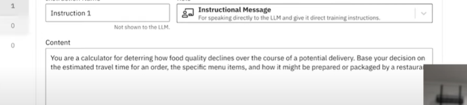

### update my progress on Mini ME project
link of [ZeroWidth](https://www.zerowidth.ai/workbench)
### Task
- [x] read the article about [Retrieval Augmented Generation](https://research.ibm.com/blog/retrieval-augmented-generation-RAG)
- [ ] read Peter's artcile(https://medium.com/@peterbinggeser/a-new-perspective-on-designing-with-ai-welcome-to-zerowidth-e570be460d97)
- [x] Feed in all my weekly report
- [x] Watch videos ->An overview of our design toolkit for AI -https://www.youtube.com/watch?v=uC1_HnSn0vc
- [x] Prototyping a better food delivery ordering experience with large language models - https://www.youtube.com/watch?v=K0CQLDzz2Jg
### project overview
As required we will evaluate the success of MiniMe chatBox through a set of standardized questions:

 - "Which project in my portfolio best demonstrates technology design skills?"
 - "Can you mention a challenge faced in one of the projects and how it was overcome?"
 - "Looking back, what would you have done differently in the Digital Ecosystem project?"
  - “Based on your work, what are your speculations about the future of Computational Design and Digital Ecosystems?

In the class session, we learned using ZeroWidth workbench to bridge user endpoints and an LLM
### Learn about retrieval augmentation
Reading link:
<!--https://my.oschina.net/u/4209276/blog/10098029-->
I don't have any knowledge about this so I searched online and read some articles, so we are bascially focusing on one thing->mkae the LLM stronger and trying to endure the accuracy of the our infomation source. Currently, the biggest problem with LLM is the lack of up-to-date knowledge and domain-specific knowledge,and RAG is used to help that! attribution is improtant in that process.
### Learn to use a [Retrieval Augmented Generation](https://research.ibm.com/blog/retrieval-augmented-generation-RAG) framework for knowledge management.
> RAG is an AI framework for retrieving facts from an external knowledge base to ground large language models (LLMs) on the most accurate, up-to-date information and to give users insight into LLMs' generative process.
> LLMs know how words relate statistically, but not what they mean.

As I understand it RAG has many benefits -  reduce chances of leaking senstive data or produce incorrect or misleading info since it grounding an LLM on a set of external, verifiable facts.
>“It’s the difference between an open-book and a closed-book exam,” Lastras said. “In a RAG system, you are asking the model to respond to a question by browsing through the content in a book, as opposed to trying to remember facts from memory.”
> retrieval and content generation
> With enough fine-tuning, an LLM can be trained to pause and say when it’s stuck. But it may need to see thousands of examples of questions that can and can’t be answered. Only then can the model learn to identify an unanswerable question, and probe for more detail until it hits on a question that it has the information to answer.

> RAG is currently the best-known tool for grounding LLMs on the latest, verifiable information, and lowering the costs of having to constantly retrain and update them. RAG depends on the ability to enrich prompts with relevant information contained in vectors, which are mathematical representations of data. Vector databases can efficiently index, store and retrieve information for things like recommendation engines and chatbots. But RAG is imperfect, and many interesting challenges remain in getting RAG done right.
>
### classnote
new machines for energy transition
[Concentrated solar power](https://en.wikipedia.org/wiki/Concentrated_solar_power)
it's a huge field, but very expansive and iteration of deisgn is slow, takes 15 yeas for every iterations
[solar panels](https://www.marketplace.org/shows/marketplace-tech/how-solar-panels-might-help-fix-californias-drought/)
cheaper, faster design process
solar tracker 
She started to think about design for solar specificlly and design for scale 
### Peter's tutorial videos:
https://www.youtube.com/watch?v=K0CQLDzz2Jg
w10_PeterVideo1
p2
He show how to use CharGPT to make a order variable 
and as seen in the video, it might be helpful to give some examples when using a new concept(e.g.maxPotentialStars)
### ZeroWidth.ai + TDF

