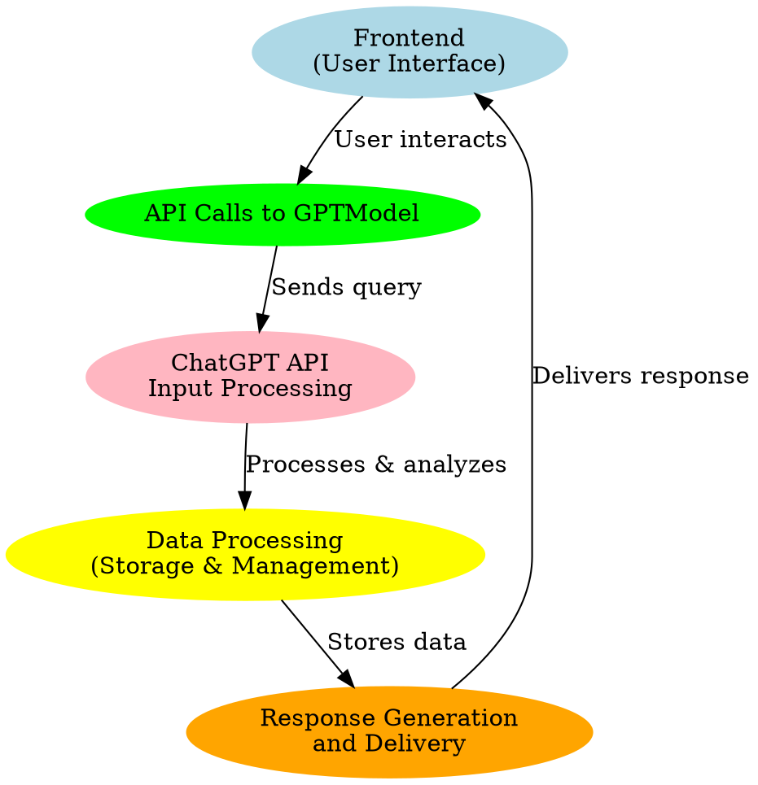

# Weekly Report - Week 13 (As of 11/23/2023)

## TODO List

### General Action Items for the Group:

- Take a diagram and expand upon it; including what the LLM is doing, etc.

### Specific Smaller Action Items

- [x] Step 1: Use Shm's platform to host a website via Vercel: [Link](https://berkeleymdes.slack.com/archives/C05JZF3EJUU/p1700088791320219)  
  (Our group has cloned Shm's repository.)
- Step 2: Basic interfacing experiment with Node.js: [Tutorial](https://learn.microsoft.com/en-us/entra/external-id/customers/tutorial-daemon-node-call-api-build-app#call-an-api)
- [ ] Step 3: Start to work on the front-facing design with CSS/HTML
- Step 4: Include JavaScript that calls the API via Node.js

## User Experience & User Flow by Figma

**Question to answer with the design diagram:** What happens in the technology stack when the user interacts with your prototype?

```dot
digraph UXFlow {
    rankdir=LR; // Sets the direction of the graph from left to right
    node [shape=box]; // Defines the shape of nodes

    // Defining nodes
    EnterWebsite [label="Enter Website"];
    ViewHomepage [label="View Homepage"];
    AccessChatbot [label="Access Chatbot"];
    InputQuery [label="Input Query"];
    SubmitQuery [label="Submit Query"];
    ChatGPTProcessing [label="ChatGPT Processing"];
    ReceiveResponse [label="Receive Response"];
    ViewResponse [label="View Response"];

    // Defining edges
    EnterWebsite -> ViewHomepage;
    ViewHomepage -> AccessChatbot;
    AccessChatbot -> InputQuery;
    InputQuery -> SubmitQuery;
    SubmitQuery -> ChatGPTProcessing;
    ChatGPTProcessing -> ReceiveResponse;
    ReceiveResponse -> ViewResponse;
}
```

Question to answer with the design diagram: What happens in the technology stack when the user interacts with your prototype?

## Links
Graphviz Online
[CodePen for Appearance Design - Rough](https://codepen.io/cc-Z/pen/XWOZPod)  

[User Experience (UX) Flow Diagram &&  Technology Stack Interaction Diagraml Suggestions](../weekly-reports/images/w13_User_Experience (UX) Flow_Diagram_Technology_Stack_Interaction_Diagram.png)
[HomePage](../weekly-reports/images/ww13_homePage.png)
[Pop-up When click into Meal Suggestions](../weekly-reports/images/w13_Pop-up.png)

