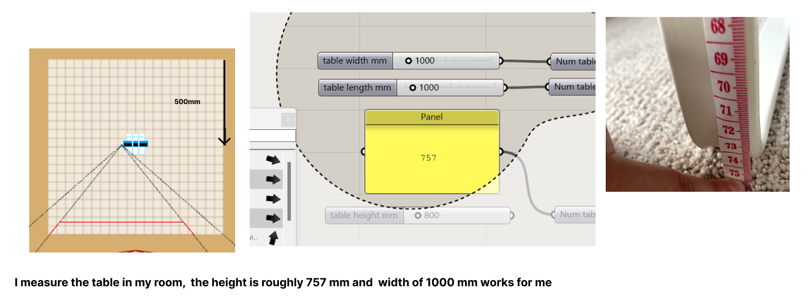
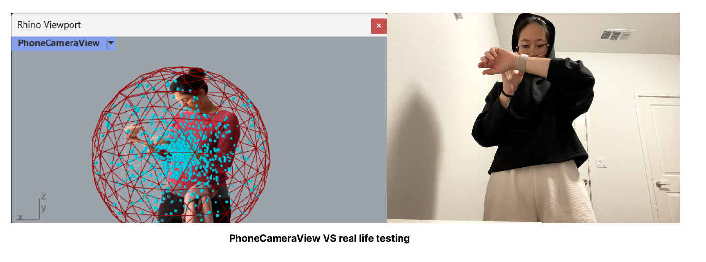

# Weekly Report - Week 1 (As of 8/30/2023)

## What I Have Done So Far:
- I learned some basic operations of Rhino.
- I have tried exploring the Grasshopper file, utilizing the "Only draw preview for geometry for selected objects" function to understand the file better.
- I measured the dimensions of my height, table height, and my phone in three dimensions and adjusted the file accordingly.
- I tried different materials like plywood and acrylic and learned my lesson of not making assumptions but rather relying on precise measurements.
  
My favorite version at this point is this one down below, made of black acrylic, generously provided by Marissa. The stitching tightness and phone compartment size are relatively better in comparison to my previous attempts.

## Testing the Black Acrylic Phone Stand:

I measured both the table height (757mm) and my height (1720mm) before cutting it out, and the phone stand did ensure my upper body stays within the camera frame. I am happy to see this result. It seemed to work well!

## Adjustments Made For Acrylic Phone Stand:

I actually redid the base section because I miscalculated the thickness of the material. While measuring the thickness of the acrylic, I didn't hold it tight enough, and I was worried that if the slots in the bottom were too small I wouldn't be able to put it together, so I purposely left a little extra room. It turns out to be a bit waggle. After re-measuring the thickness of the acrylic and adjusting the setting to 0.137 inches, it feels much better!

## Failed Attempts:

My second plywood stand on Wednesday morning was not working at all. I failed to measure my phone's actual dimensions, relying instead on a Google search plus my assumption, which led to a ridiculous result, and also the part of the back is cut off.

## Other Plywood Stand:

- Another plywood stand from Tuesday, which works fine but I did not adjust the parameters.

## Learning:

I’m happy that I learned how to use the "deconstruct brep" and "join curves" tools to obtain edge curves. When modifying parameters, it updates automatically.

## Reflections:
As a first-time user of Rhino and Grasshopper, I watched several tutorials and tried to draw parallels between Rhino and other 3D software (such as Blender) to aid my learning process. I found that my past experience with Blender is helpful, as it instilled the mindset that certain functions should be available for users. For instance, I was looking for a more precise zooming method in Rhino– "alt + right key. Without prior knowledge of its existence, I might have only used the middle mouse button and continually complained about it. There are certain functions all 2D/3D design tools are sharing, recognizing those functions are available even if we lack immediate knowledge to use, but it helps us to seek solutions when needed. However, many other functions, such as selecting the camera to view, are very different in this rhino file. It really took me a while to get to understand a bit where does this camera come from in Grasshopper and how that view is generated. While in Blender, it just a simple click of "Control+Alt+0”. In general, exploring GrassHopper is really fun, and I really like that in the end I am able to compare the PhoneCameraView and real life view.

## Speculations:

If I iterate further, I want to create an adjustable angle phone stand similar to the pink one shown in the image.

---
Report by [Yunting Zhao]
