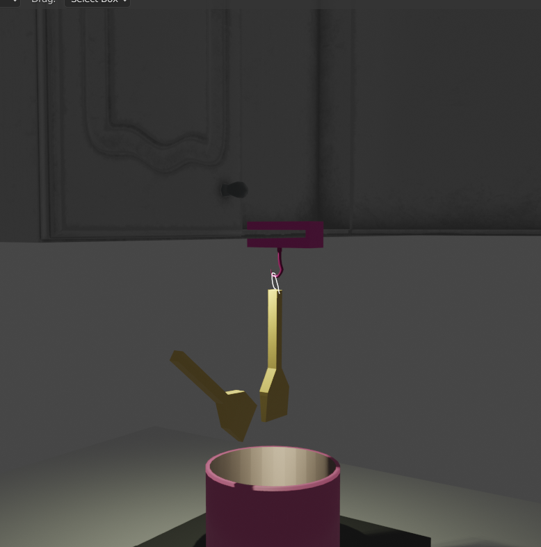

# Weekly Report - Week 2 (As of 9/5/2023)

## What I Have Done this week: 
TBUpdate
# 9/2/2023
## Understanding Computational Design

> The essence of computational design lies in utilizing advanced computer processing to solve design problems through a combination of algorithms and parameters.

To me, it feels akin to when I used Blender to construct scenes: wanting to achieve quick iterations by tweaking parameters instead of constructing a rigid model.
I've recently been intrigued by the concept after our class lecture and reading enlightening articles about computational design. The insights and potential applications inspired me to start a personal project.
Last week, I explored laser cutting, and this week I'm eager to jump into 3D printing, focusing on the reorganization of the design process.

## Inspiration & References

One practical issue I've encountered is finding a vessle for my spatula or cooking tools while cooking. My design goal is to avoid the need for an extra dish just to rest utensils. Some contemporary designs offer a flat top on pot lids for this purpose, but not all pot lids come with this feature. I envision a tool that can hold the utensil upside down, allowing it to rest by the side of the cooking pot.

## Challenges & Problems that I can think of

A challenge lies in testing the design before actual 3D printing. Unlike the phone stand example in class where the results were observable, this kitchen tool doesn't allow for direct interaction simulations. This issue remains to be addressed.

Safety is paramount. ABS plastic is generally considered unsafe for food as it can leach toxins. Conversely, while natural PLA made from corn is deemed safe, additives used for coloring or modification might not be. The design should ideally minimize contact between the utensil and the holder and allow for ventilation to avoid overheating.

## Design Idea

Most kitchens are equipped with either a hood or cabinets above the stovetop. A utensil holder could potentially be mounted there.

Basic Design Principles

Utensils should tilt downwards so liquids drip back into the pot.
Consideration for kitchens with either a hood or cabinets above.
Tilted Bracket Design: A tilted bracket ensuring the utensil's food-facing side is downward, allowing residues to flow back into the pot.
Hanging Bracket Design: An adjustable hanging system that suspends the utensil, ensuring residues flow back to the pot and the holder remains clean.
Preliminary Thoughts on Hanging Utensil helper:

The design should be as small as possible for efficient 3D printing.
The primary objective is to design a holder that doesn’t get stained with sauces or broths, eliminating the need for cleaning.
I’m currently leaning towards the hanging bracket design due to its simplicity.
