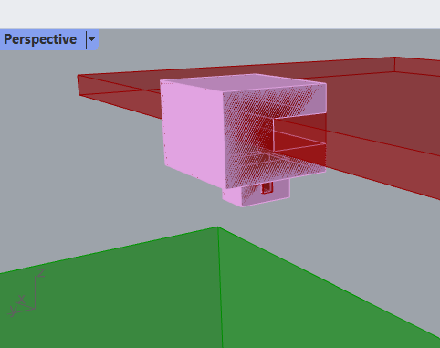
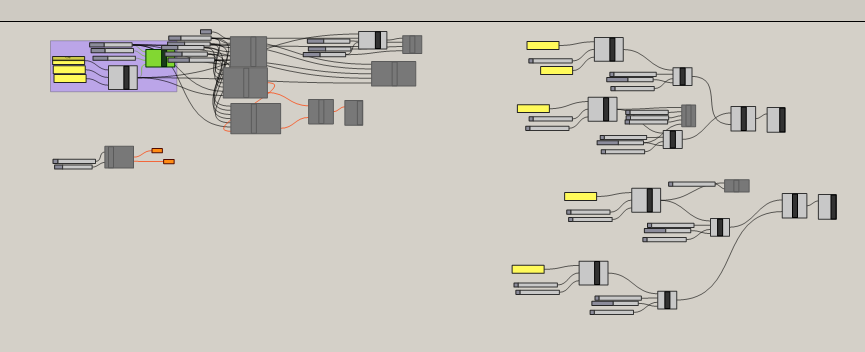
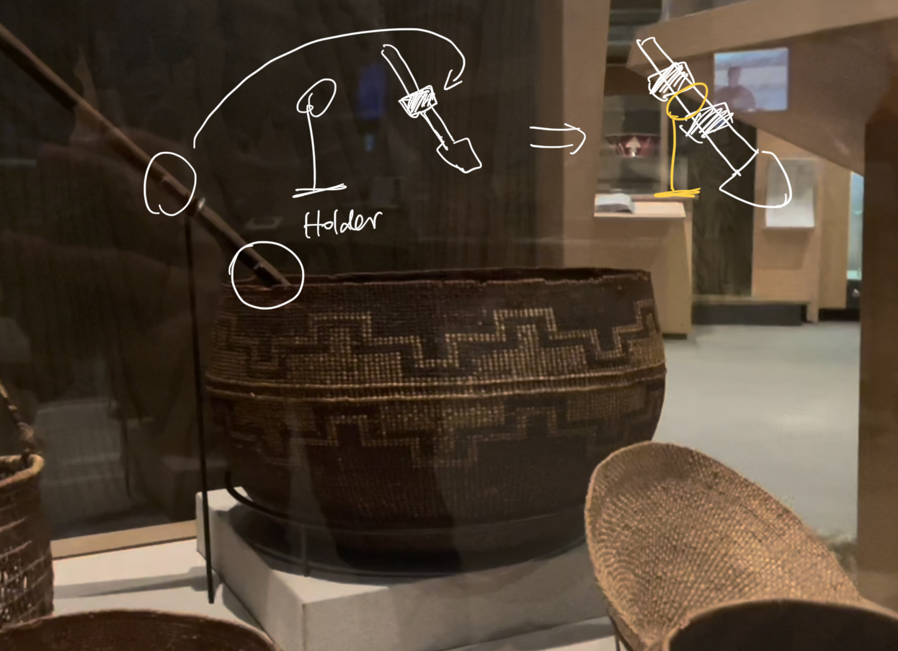
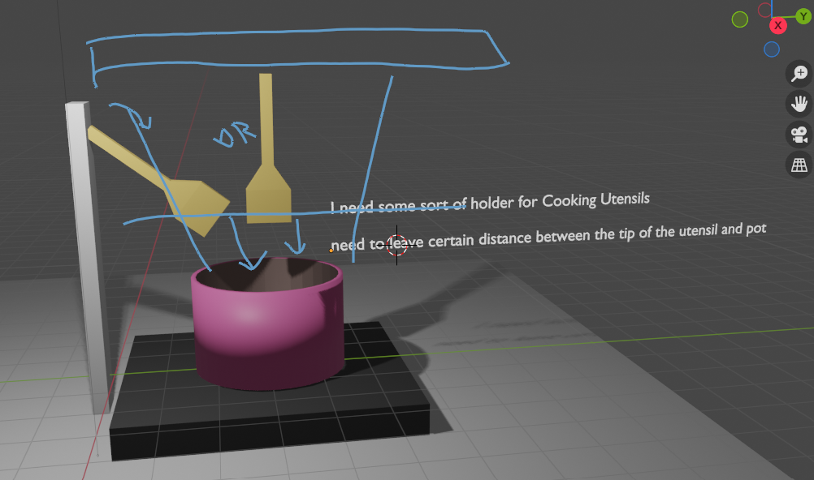
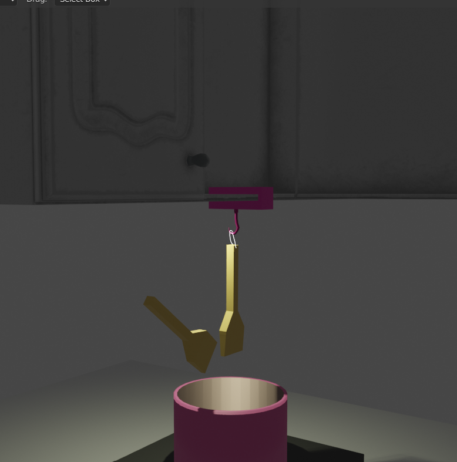
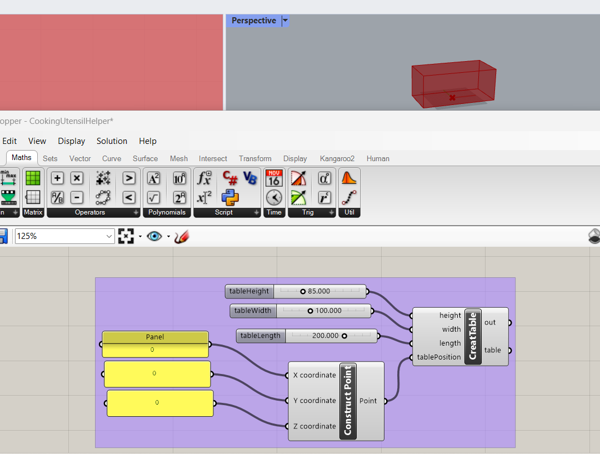
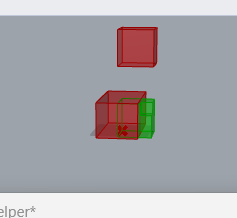
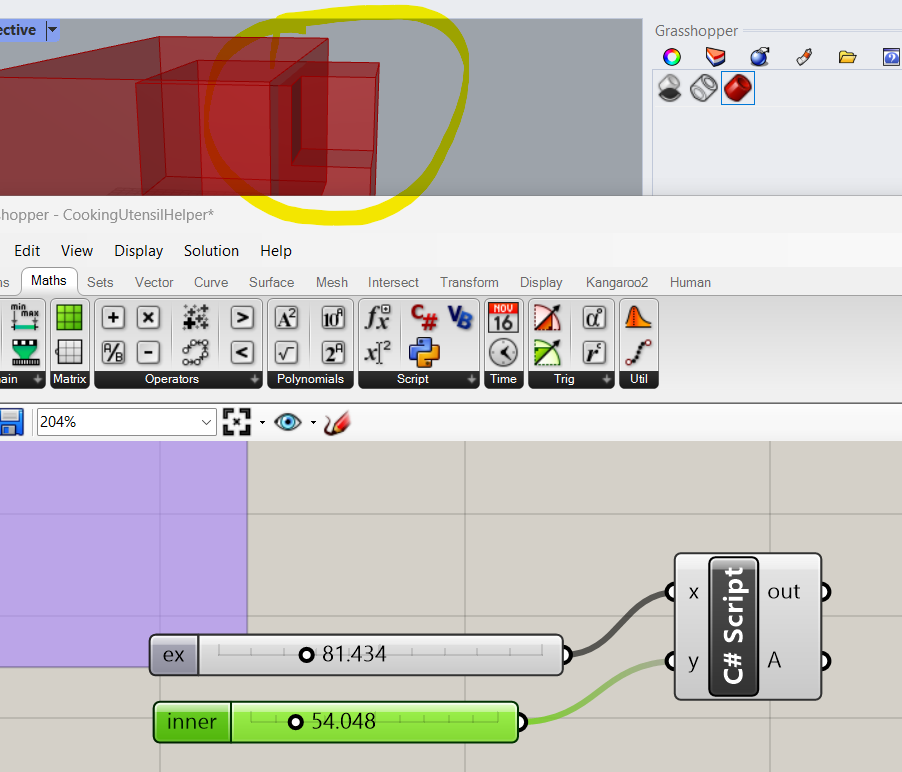
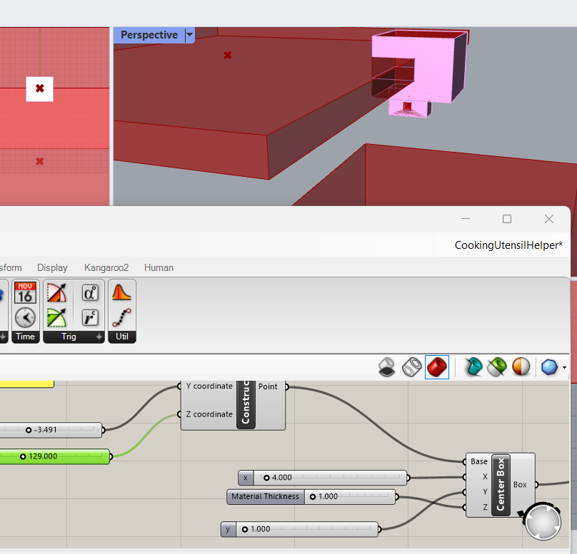

# Weekly Report - Week 2 (As of 9/7/2023)

## What I Have Done this week && Reflections && Speculations: 
A cookingHelper!



In general, I am relatively satisfied with the amount of work I accomplished this week. I read some computational design materials and engaged in deep thinking. I started conceptualizing in Blender, drew inspiration from visiting museums, and then returned to Rhino to continue my work, exploring C#. This part was interesting to myself, but it actually consumed a significant amount of my time. It took me about 2 hours just to figure out how to use C# in Grasshopper and to create my first cuboid. All of that effort for a single cuboid...it might not worth it, but I do quite enjoy the process of exploration. The unsatisfactory part is probably this image; please see below. My Grasshopper file is exceptionally messy. Additionally, there are many things that still need further refinement

<!-- I will try to get the file half way done by tonight(9/6) so that i have something to show tomorrow. also I am planning to print it before next monday -->
## Understanding Computational Design

> The essence of computational design lies in utilizing advanced computer processing to solve design problems through a combination of algorithms and parameters.

To me, it feels akin to when I used Blender to construct scenes: wanting to achieve quick iterations by tweaking parameters instead of constructing a rigid model.
I've recently been intrigued by the concept after our class lecture and reading enlightening articles about computational design. The insights and potential applications inspired me to start a personal project.
Last week, I explored laser cutting, and this week I'm eager to jump into 3D printing, focusing on the reorganization of the design process.

## Inspiration & References

One practical issue I've encountered is finding a vessle for my spatula or cooking tools while cooking. My design goal is to avoid the need for an extra dish just to rest utensils. Some contemporary designs offer a flat top on pot lids for this purpose, but not all pot lids come with this feature. I envision a tool that can hold the utensil upside down, allowing it to rest by the side of the cooking pot.
Last Sunday, I visited the Oakland Museum of California (OMCA) and saw this(that's pretty much what I have in my head at the very beginning):




## Challenges & Problems that I can think of

A challenge lies in testing the design before actual 3D printing. Unlike the phone stand example in class where the results were observable, this kitchen tool doesn't allow for direct interaction simulations. This issue remains to be addressed.

Safety is paramount. ABS plastic is generally considered unsafe for food as it can leach toxins. Conversely, while natural PLA made from corn is deemed safe, additives used for coloring or modification might not be. The design should ideally minimize contact between the utensil and the holder and allow for ventilation to avoid overheating.

## Design Idea

Most kitchens are equipped with either a hood or cabinets above the stovetop. A utensil holder could potentially be mounted there.



Basic Design Principles

Utensils should tilt downwards so liquids drip back into the pot.
Consideration for kitchens with either a hood or cabinets above.
Tilted Bracket Design: A tilted bracket ensuring the utensil's food-facing side is downward, allowing residues to flow back into the pot.
Hanging Bracket Design: An adjustable hanging system that suspends the utensil, ensuring residues flow back to the pot and the holder remains clean.
Preliminary Thoughts on Hanging Utensil helper:



The design should be as small as possible for efficient 3D printing.
The primary objective is to design a holder that doesn’t get stained with sauces or broths, eliminating the need for cleaning.
I’m currently leaning towards the hanging bracket design due to its simplicity.
## WIP
I started from building my own kitchen table. I searched online, and it seems like the optimum size for a kitchen table is 850mm, with the cabinet usually being 450mm above the table. First, I attempted to create a box, but then I discovered that Rhino supports both C# and Python. I was really interest in that and wanted to explore the C# script in Rhino, so I began trying to code the table section.
```csharp
private void RunScript(object height, object width, object length , object tablePosition, ref object table)
{
    double h = 0.0;
    double w = 0.0;
    double l = 0.0;
    Point3d position = Point3d.Origin; // Default position at the origin

    // Convert height, width, and length to doubles
    if (height != null) h = Convert.ToDouble(height);
    if (width != null) w = Convert.ToDouble(width);
    if (length != null) l = Convert.ToDouble(length);

    // Convert tablePosition to Point3d
    if (tablePosition != null && tablePosition is Point3d)
    {
        position = (Point3d) tablePosition;
    }

    // Calculate the translation vector to move the cuboid to the specified position
    Vector3d translationVector = new Vector3d(position - new Point3d(l / 2.0, w / 2.0, 0.0));

    // Create a translation transform
    Transform translation = Transform.Translation(translationVector);

    // Create a cuboid with its center at the specified position
    Brep cube = Brep.CreateFromBox(new BoundingBox(Point3d.Origin, new Point3d(l, w, h)));

    // Apply the translation to move the cuboid to the specified position
    cube.Transform(translation);

    // Set the table parameter to the translated cuboid
    table = cube;
}
```

Next was the cabinet. I attempted to calculate a hollow cabinet by using material thickness as the difference. Here's part of my code:

```csharp
 // Create a Brep representing the inner shell (hollow part) of the cabinet
    Brep innerShell = Brep.CreateFromBox(new BoundingBox(new Point3d(innerX, innerY, innerZ), new Point3d(innerX + innerLength, innerY + innerWidth, innerZ + innerHeight)));

    // Subtract the inner shell from the outer shell to create the hollow cabinet
    Brep[] difference = Brep.CreateBooleanDifference(new Brep[] { outerShell }, new Brep[] { innerShell }, 0.001);

    if (difference.Length > 0)
    {
      cabinet = difference[0]; // Set the cabinet as the resulting hollow shape
    }
```



However, there must be something wrong because my difference.Length was less than 0 always. Eventually, I had to try using the thickness directly as the height and constructed a panel as the cabinet's floor.


Based on the floor, I continued to create a component part that could clamp onto the cabinet's floor. In the end, this part should be able to fit into the cabinet. My idea was to have hooks or a passage for a string underneath to hang kitchen utensils.


