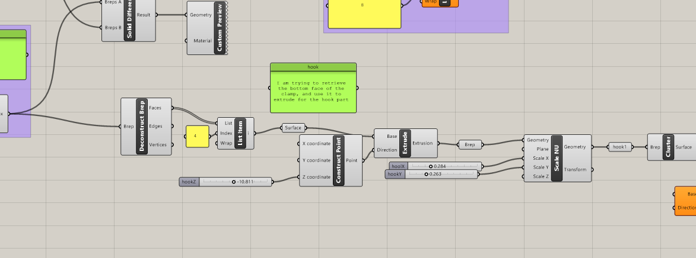
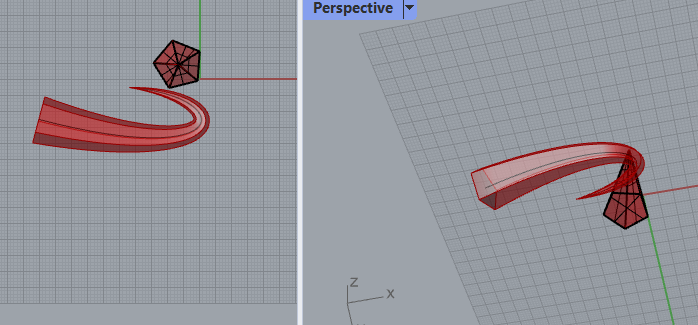
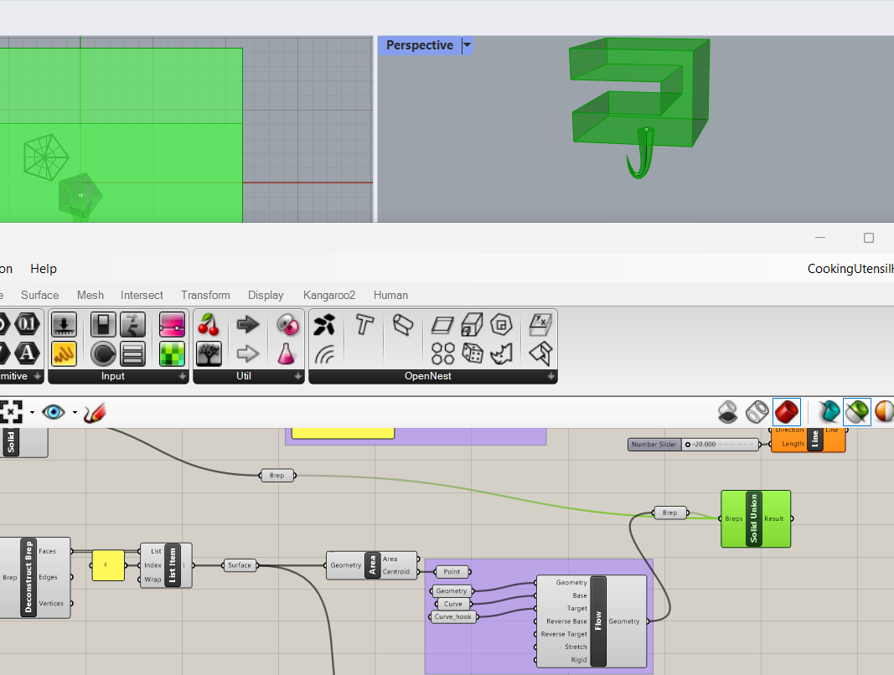

# Week 3 TODO

- [ ]  Part 2 - Personalization Cell Phone Stand/or anything else
- [ ]  Create a How-To Video
- [ ]  Peer Review and Feedback
- [ ]  Summarize the feedback received from the peer review in a PDF

## Refine my file

Today is 9/10/2023, and my goal is to improve my `kitchenHelper` file!

Last week, I asked Jeff how to create a hook because the way I was doing it seemed quite silly... just like box modeling with Grasshopper. As you can see here, I really tried to retrieve the bottom face of my clamp and them extrude it. After exttruding, I did the rescale and was going to do repeatdly until I got the hook shape.🔽

Since I did everything solely in Grasshopper and was struggling, you can see here that I am trying to retrieve the bottom face to use it for the beginning part of the hook.

Thank you, Jeff, for sharing some awesome tutorials! With your help, I can now easily build a hook.
 
*Caption: Learning to create curves for the hook*

*Caption: Merging components for the final design*

This is what I accomplished by following the hook tutorial. I'm planning to 3D print it tomorrow! 😄

