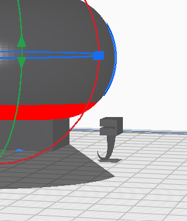
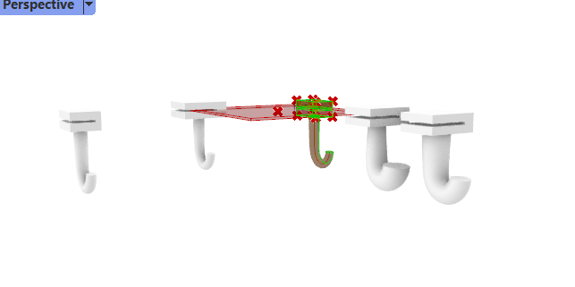
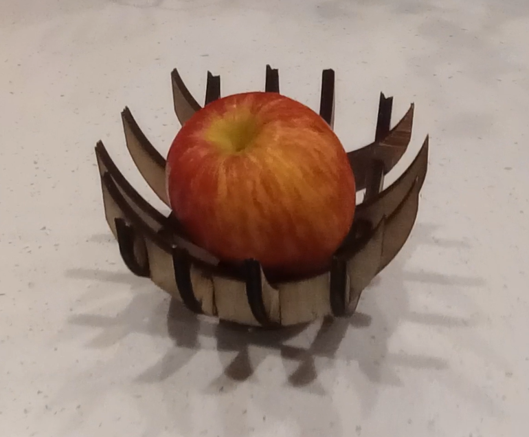

# Weekly Report - Week 3 (As of 9/14/2023)
## Week 3 TODO
- [x] Personalization Cell Phone Stand/or anything else
- [x] Create a How-To Video
- [x] Peer Review and Feedback
- [x] Summarize the feedback received from the peer review in a PDF
- [ ] Based on peer review, re-edit my video and weekly report

## Refine my file
### 9/10/2023
Today is 9/10/2023, and my goal is to improve my `kitchenHelper` file!

Last week, I asked Jeff how to create a hook because the way I was doing it seemed quite silly... just like box modeling with Grasshopper. As you can see here, I really tried to retrieve the bottom face of my clamp and them extrude it. After exttruding, I did the rescale and was going to do repeatdly until I got the hook shape.🔽

Since I did everything solely in Grasshopper and was struggling, you can see here that I am trying to retrieve the bottom face to use it for the beginning part of the hook.

Thank you, Jeff, for sharing some awesome tutorials! With your help, I can now easily build a hook.
 
*Caption: Learning to create curves for the hook*

*Caption: Merging components for the final design*

This is what I accomplished by following the hook tutorial. I'm planning to 3D print it tomorrow! 😄

### 9/11/2023

My 3D modle size is too small, and all the 3D printers are currently occupied. I will go back tomorrow to print it.

### 9/12/2023

Today, when I attempted to print, I encountered a couple of issues. Firstly, the top of my hook was too thin, and Cody suggested widening it; otherwise, it wouldn't print properly. I improved the design by modifying a flat surface of the hook tip. Another issue that was raised is that the slot inside the model was too narrow, and I was advised to remove it. In the afternoon on the 12th, I made improvements based on the points mentioned above. However, I suddenly felt that it didn't make sense anymore. 

Without the internal slot, the design itself becomes pointless. My practical design experience is limited, leading to a lack of foresight in this area. I had a chat with Chris to ask for advice on how to turn it into an adjustable clamp. He suggested creating a hole at the bottom of the clamp and embedding a bolt into it. By turning the bolt upwards, it would compress the slot space, creating an adjustable slot. However, this project requires a significant amount of work and time for a beginner like me. We also considered the possibility of laser cutting, slicing the 3D geometry, and then gluing it together. But I don't think I can complete it before the deadline. Now, I need to change direction.

## new pivot
### 9/13/2023

I decided to create an apple basket. I'll lift an apple onto it every day to remind myself to eat apples. After searching online for similar tutorials and watching some videos, I found a similar tutorial and began designing the apple holder. The final result is as follows:

For more details, please check out my week 3 report video here:

_click the img to watch the video🔽_

