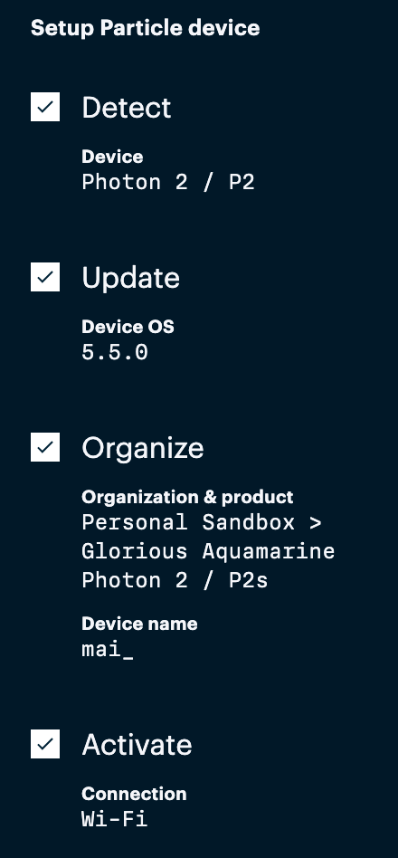
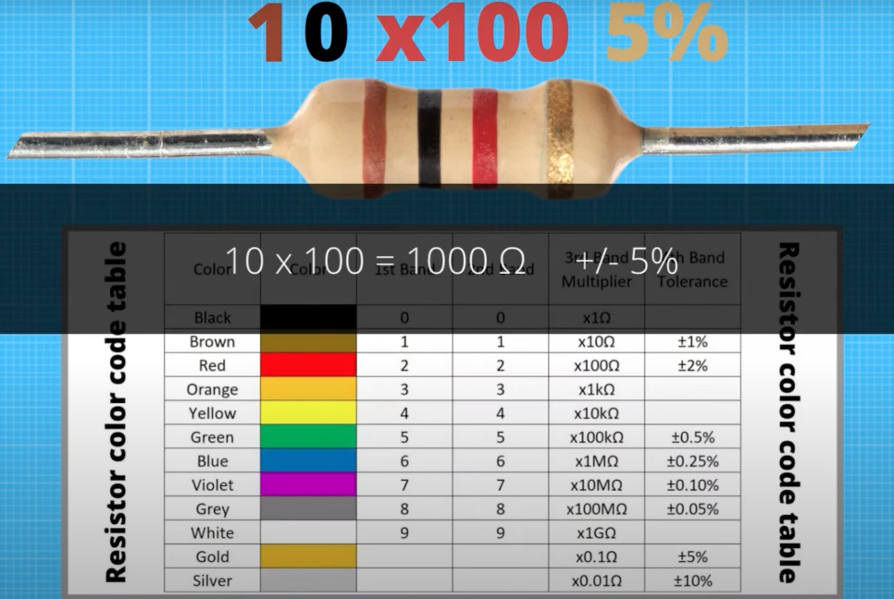
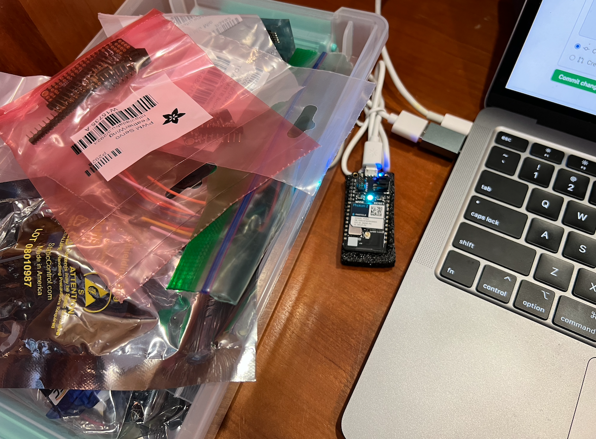

# Weekly Report - Week 4 (As of 9/21/2023)
Setup my photon, I accidently put the name mai_ as my device name😅 
## Useful links 
https://docs.particle.io/photon-2/

https://console.particle.io/

[ GetMacAddress.ino](https://build.particle.io/shared_apps/6507d59801c67400099a4ce3)

[USB serial debug log](https://docs.particle.io/tools/developer-tools/usb-serial/)

[UCB wifi loT](https://portal.berkeley.edu/people/wifi_access)

[practice](https://fritzing.org/)

[photon demo](https://www.youtube.com/watch?v=784uyX4nXRI)

<!-- bilibili IFTTT https://www.bilibili.com/video/BV1x54y1n7Av/?spm_id_from=333.337.search-card.all.click -->

## Week 4 TODO
- [x] hello world!
- [x] connect Photon2 Berkeley IoT Wi-Fi
- [WIP] know what's in the box, watching tutorials
## Reflections
I am so happy that starting form this week we are offcially done with grasshopper and have dived into the Particle Photon 2 project. I watched some videos on utilizing photon and [IFTTT](https://www.youtube.com/watch?v=61_pxTvpzQ0) this week. Although it's my first time using photon 2, I am genuinely looking forward to it! So far, I have set up my photon 2 and also connected to Berkeley IoT Wi-Fi:



## Speculations
I want to continue exploring what can i do with this toolkit, discover some exciting IFTTT projects, and also see what fun games I can create with this toolkit!


## class note

```c++
  void setup() {
    //initialize serial communications
    //run one time only
    Serial.begin();
}
//delay(1000); - 1 second
//SYSTEM_THREAD(ENABLED); make the photon do whatever it should
void loop() {
	// Turn on the LED
	digitalWrite(MY_LED, HIGH);

	// Leave it on for one second
	delay(1s);

	// Turn it off
	digitalWrite(MY_LED, LOW);

	// Wait one more second
	delay(1s);

	// And repeat!
}
```
```c++
// We define MY_LED to be the LED that we want to blink. 
//
const pin_t MY_LED = SCK; // external LED
const pin_t BLUE = D7; // internal LED
const pin_t D = D3; // Define D3 LED with the appropriate pin number

// The following line is optional, but recommended in most firmware. It 
// allows your code to run before the cloud is connected. In this case, 
// it will begin blinking almost immediately instead of waiting until 
// breathing cyan,
SYSTEM_THREAD(ENABLED);

// The setup() method is called once when the device boots.
void setup() {
	// In order to set a pin, you must tell Device OS that the pin is 
	// an OUTPUT pin. This is often done from setup() since you only need 
	// to do it once.
    pinMode(MY_LED, OUTPUT);
    pinMode(D, OUTPUT);
    pinMode(BLUE, OUTPUT);
}

// The loop() method is called frequently.
void loop() {
    // Turn off the D7 (BLUE) LED, i didn't know that we have to turn it off manually 
    digitalWrite(BLUE, LOW);
	// Turn on the LED
	digitalWrite(MY_LED, LOW);
	digitalWrite(D, HIGH);

	// Leave it on for one second
	delay(1s);
	

	// Turn it off
	digitalWrite(MY_LED, HIGH);
	digitalWrite(D, LOW);

	// Wait one more second
	delay(1s);

	// And repeat!
}
```


