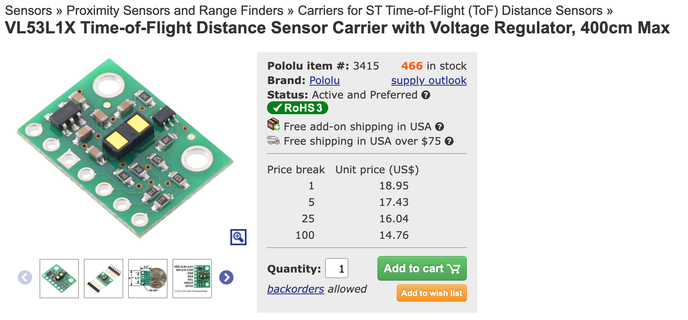
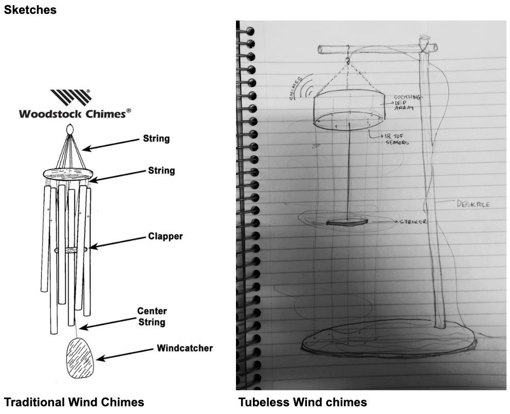

# Weekly Report - Week 5 (As of 9/27/2023)

## Reflections && Speculations
This week, I joined wind chimes project group. Wind chimes have been fascinating as tools, ranging from warding off negativity to becoming intricate instruments that produce harmonious sounds. What intrigued me most was how modern techniques have managed to refine the sounds of these chimes. This helped our team gain perspective on our project: our goal isn't just to innovate but to recreate that whimsical, peaceful sound, connecting the listener with their surroundings. We are planning to utilize Time of flight sensor to build this chimes

## Project Specs Overview

Problem Statement: A modern take on the wind chimes using infrared sensors to connect wind movement with sound.

Description: Introducing a two-stage design approach - a small-scale prototype and a large-scale interactive art installation.

Incorporation of Digital Ecosystem: Our project takes movement as an input and gives auditory and visual feedback, making it a part of the digital ecosystem.

Materials Used: Sensors, photon, speaker, Bluetooth module, LED array, and other essential components.

Sketch by Roushan 

