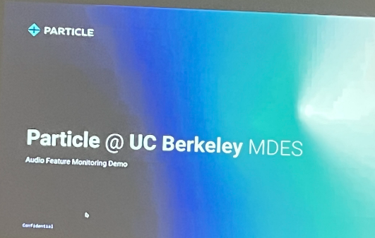
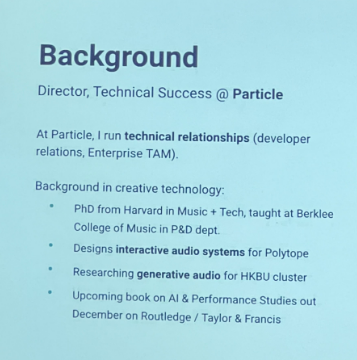
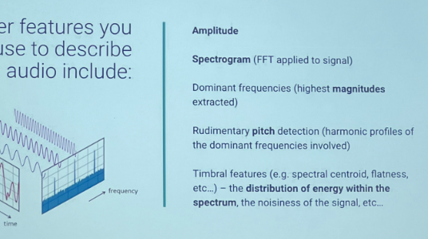
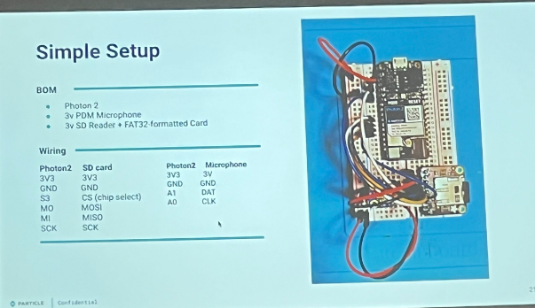
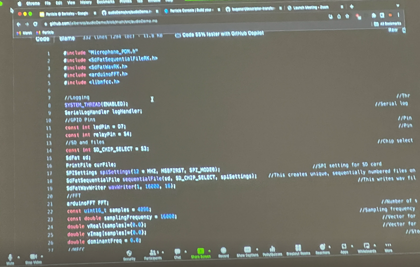
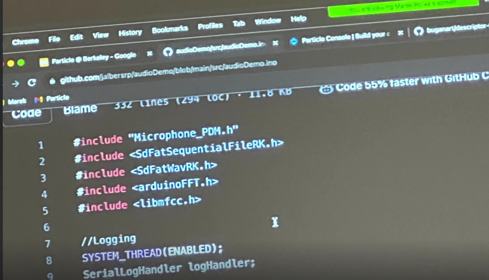
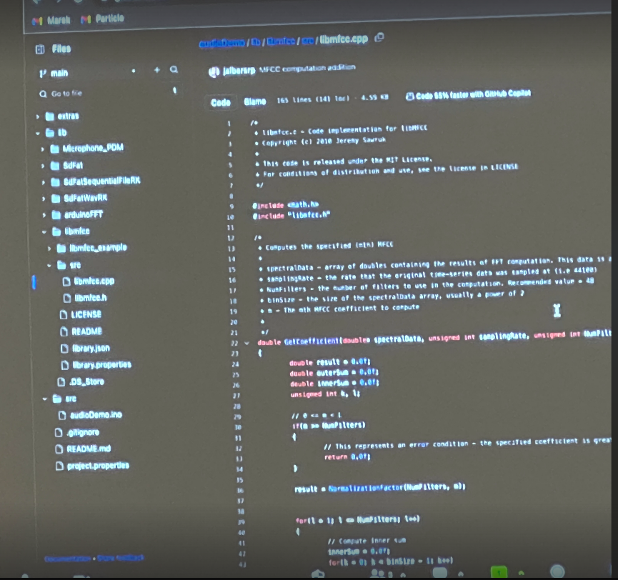
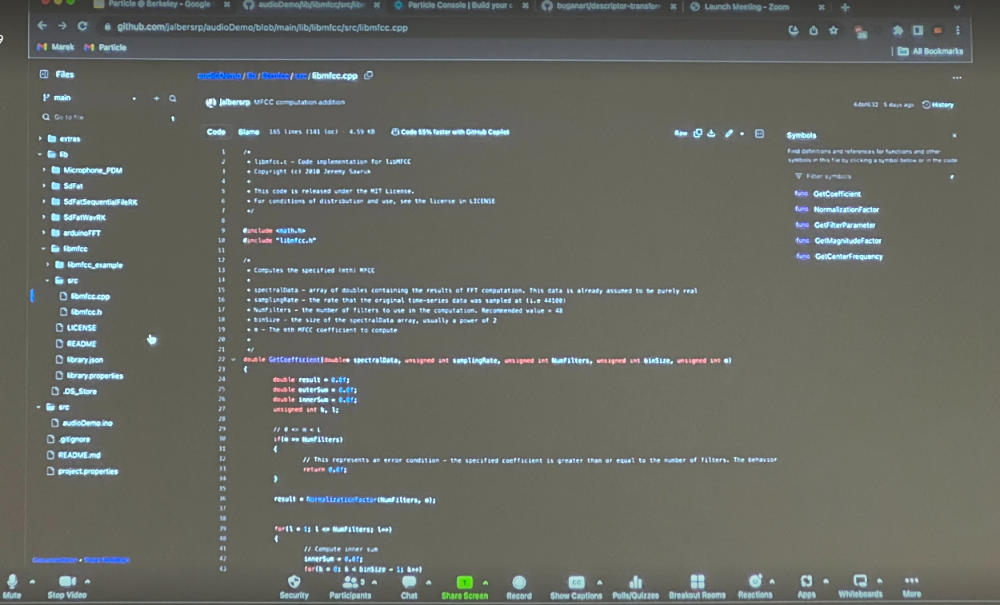
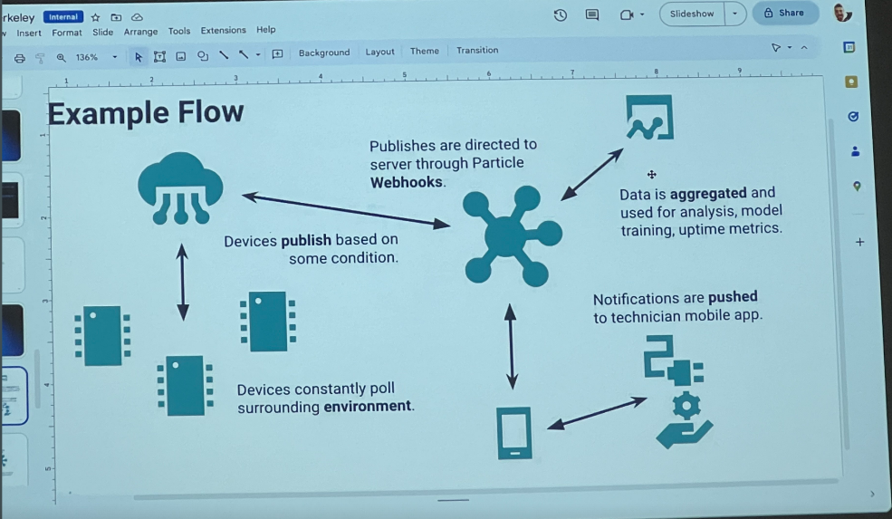

# Weekly Report - Week 7 (As of 10/9/2023)

## class note + Recent updates

For our group project, I am exploring sound part with Kirk for the windchimes. Jeff introduced us tone.js: https://tonejs.github.io/
Useful link:
https://cdnjs.com/libraries/tone
I found some tutorials online and started to set it up.
https://www.youtube.com/watch?v=ftGuDvm5zDQ
So far I downloaded node.js and import tone library. Now I am using vsCode and live-server to play with it: 
```html
<!DOCTYPE html>
<html lang="en">
<head>
    <meta charset="UTF-8">
    <meta name="viewport" content="width=device-width, initial-scale=1.0">
    <title>My Music Project</title>
</head>
<body>
    <button id="playButton">Play Music</button>
    <script type="module" src="./script.js"></script>
</body>
</html>

```
```javascript
import * as Tone from './node_modules/tone/dist/Tone.js';

//sample code from their page
const synth = new Tone.Synth().toDestination();

document.getElementById('playButton').addEventListener('click', () => {
    const now = Tone.now();
    synth.triggerAttackRelease("C4", "8n", now);
    synth.triggerAttackRelease("E4", "8n", now + 0.5);
    synth.triggerAttackRelease("G4", "8n", now + 1);
});

```
I am still having sound issues. WIP 
### Monday's class
[what is nodeRed?](https://realpars.com/node-red/)










## Task
Due to the sound issue, we consalt Jeff and got feedback:" A webhook enables you to push/pull data to/from a remote server via a specific format.  In the case of JS, many people use JSON.  You’d then implement a callback serverside to pick up on this data when it changes. 
Marek covered webhooks and how to add them via the Particle console last night in his talk.
I also have a couple tutorials I can pass you, if that’s useful.  Regardless, I’m not sure I understand the need to utilize tone.js if you just need a proof of concept.  I would highly recommend getting something like audio output via the tone() function working with the photon2 first so that you can test this quicker."
we will work based on this for the following weekend!

## Reflections && Speculations
This week's exploration into tone.js was both challenging and insightful. While we grappled with sound issues, the tutorials and Jeff's feedback were invaluable. We've been reminded of the importance of starting with foundational tools before diving into advanced ones. The concept of using webhooks and the Particle console to manipulate data efficiently, especially with JSON, has expanded our perspective. As we proceed, we aim to balance basic techniques with innovative solutions, ensuring effective learning and progress on our project.
