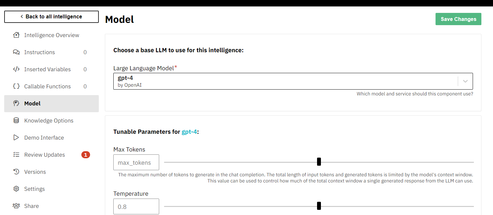
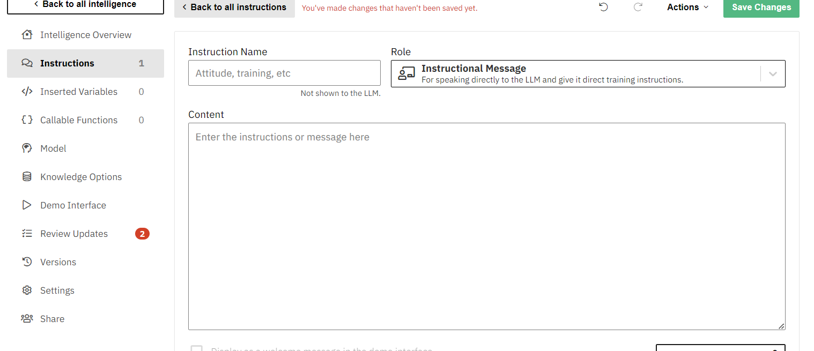
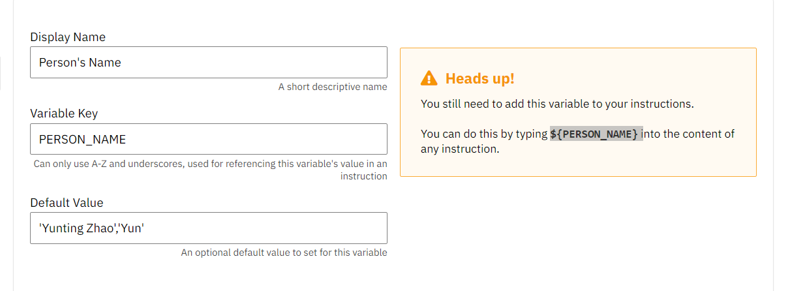

# Weekly Report - Week 9 (As of 10/26/2023)
## 10/20/23

Last Thursday, we had a review session for all the projects submitted by our peers, which was both enjoyable and inspiring.

Peter Binggeser: Designing Intelligence
Today, we are going to learn about customizing Language Model (LLM). @zeroWidth

Step1:
Pretraining - pass a massive amount of raw text(tokens) through a giant neural network.

Step2:
Fine tuning - Train on structured supervised promp t& response example data.
e.g. hugging face/OpenOrca 

Setp3:
RLHF(Reinforcement Learning from Human Feedback) - Generate options and select the best one to reinforce the model 
Foundational Model - leveageable 
>"An LLM is a black box that does autocomplete very well"
Now setup ZeroWidth.ai

https://zerowidth.ai/new/component?scope=Ww6O8fCCwwzNjx6ZE4mf
Total_tokens 
Learn more about larger ecosystem on pinecone:
https://www.pinecone.io/
### class note
the model can be edit here, defualt one is gpt

This is where to add a new instructions 

This is how we add a instruction variavle 

