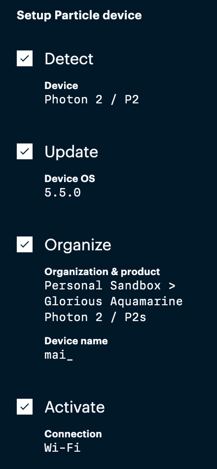
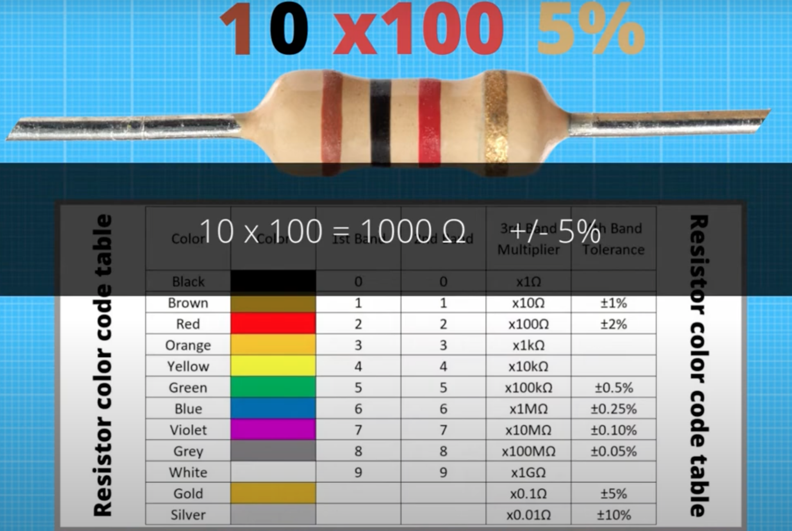

# Weekly Report - Week 4 (As of 9/21/2023)
Setup my photon, I accidently put the name mai_ as my device name😅 
## Useful links 
https://docs.particle.io/photon-2/

https://console.particle.io/

[ GetMacAddress.ino](https://build.particle.io/shared_apps/6507d59801c67400099a4ce3)

[USB serial debug log](https://docs.particle.io/tools/developer-tools/usb-serial/)

[UCB wifi loT](https://portal.berkeley.edu/people/wifi_access)

[practice](https://fritzing.org/)

[photon demo](https://www.youtube.com/watch?v=784uyX4nXRI)

<!-- bilibili IFTTT https://www.bilibili.com/video/BV1x54y1n7Av/?spm_id_from=333.337.search-card.all.click -->

## Week 4 TODO
- [x] hello world!
- [x] connect Photon2 Berkeley IoT Wi-Fi
- [WIP] know what's in the box, watching tutorials
## Reflections
I am so happy that starting form this week we are offcially done with grasshopper and have dived into the Particle Photon 2 project. I watched some videos on utilizing photon and [IFTTT](https://www.youtube.com/watch?v=61_pxTvpzQ0) this week. Although it's my first time using photon 2, I am genuinely looking forward to it! So far, I have set up my photon 2 and also connected to Berkeley IoT Wi-Fi:

## Speculations
I want to continue exploring what can i do with this toolkit, discover some exciting IFTTT projects, and also see what fun games I can create with this toolkit!

